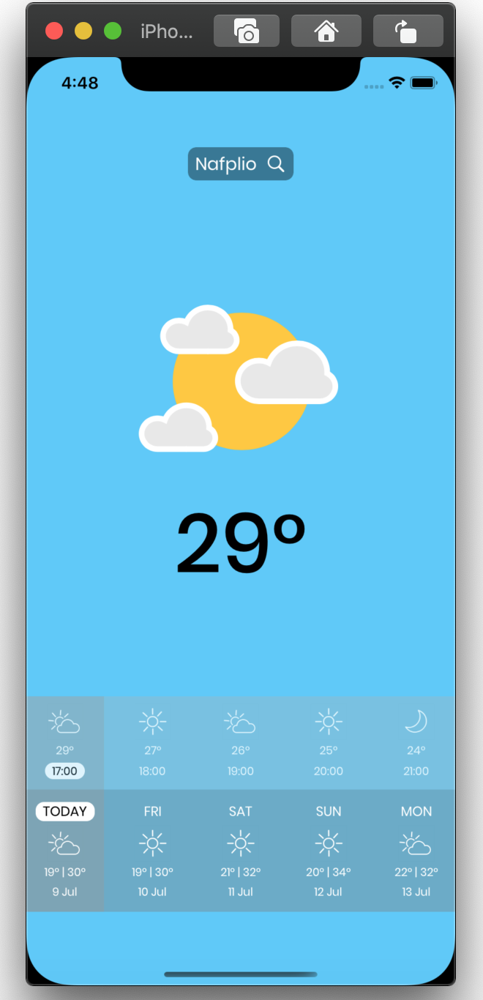

# WeatherApp - iOS - MVP + Clean Architecture Demo 
[](https://travis-ci.com/billidani7/WeatherApp)

<p align="center">


</p> 

### High Level Layers

### MVP Concepts

##### Presentation Logic

-   `View`  - The View works with the` Presenter` to display the data and it notifies the `Presenter` about the user’s actions.
    -   All  `UIViewController`,  `UIView`,  `UITableViewCell`  subclasses belong to the  `View`  layer
    -   Usually the view is dumb - it shouldn't contain any complex logic. Most of the times we don't need write Unit Tests for it.

-   `Presenter`  - contains the presentation logic 
    -   Usually we have one  `Presenter`  per scene (view controller)
    - The presenter triggers the business logic and tells the view when to update. It therefore interacts with the model and fetches and transforms data from the model to update the view
    -   It doesn't reference the concrete type of the  `View`, but rather it references the  `View`  protocol that is implemented usually by a  `UIViewController`  subclass
    - The presenter should not have, if possible, a dependency to ay `iOS`  framework classes
    -   It should be a plain  `Swift`  class and not reference any  `iOS`  framework - this makes it easier to reuse it maybe in a  `macOS`  application
    -   It should be covered by Unit Tests
   
   -   `Configurator`  - injects the dependency object graph into view controller
	   -   Contains very simple logic and we don't need to Unit Test it
	
-   `Router`  - contains navigation / flow logic from one scene (view controller) to another
    -   Usually we try to keep it really simple and we don't write Unit Tests for it
    -   It is usually referenced only by the  `Presenter`  

### Clean Architecture Concepts
##### Application Logic
-   `UseCase / Interactor`  - contains the application / business logic for a specific use case in your application
	-  Mediates between the presenter and the data. It takes direction from the presenter.
    -   It is referenced by the  `Presenter`. The  `Presenter`  can reference multiple  `UseCases`  since it's common to have multiple use cases on the same screen
    -   It controls  `Entities`  and communicates with  `Gateways`  to retrieve / persist the entities
    -   The  `Gateway`  protocols should be defined in the  `Application Logic`  layers and implemented by the  `Gateways & Framework Logic`
    -   The separation ensures that the  `Application Logic`  depends on abstractions and not on actual frameworks / implementations
    -   It should be covered by Unit Tests
-   `Entity`  - plain  `Swift`  classes / structs
    -   Represents application data.

##### Gateways & Framework Logic
-   `Gateway`  - contains actual implementation of the protocols defined in the  `Application Logic`  layer
    -   We can implement for instance a  `LocalPersistenceGateway`  protocol using  `CoreData`  or  `Realm`
    -   We can implement for instance an  `ApiGateway`  protocol using  `URLSession`  or  `Alamofire`
    -   We can implement for instance a  `UserSettings`  protocol using  `UserDefaults`
    -   It should be covered by Unit Tests
 
 -   `Persistence / API Entities`  - contains framework specific representations
	    -   For instance we have a  `CoreDataCity`  that is a  `NSManagedObject`  subclass
	    -   The  `CoreDataCity`  would not be passed to the  `Application Logic`  layer but rather the  `Gateways & Framework Logic`  layer would have to "transform" it to a  `City`  entity defined in the  `Application Logic`  layer
	    
-   `Framework specific APIs`  - contains implementations of  `iOS`  specific APIs such as sensors / bluetooth / camera


We would like to create list of cities with ability to `add` and `remove` a city to the list. Also the list should be persisted locally. As mentionded before,  we will define a protocol to the `Application Logic` layer and we will implement it at  `Gateways & Framework Logic` layer.

The protocol:
```swift
typealias FetchCitiesEntityGatewayCompletionHandler = (_ cities: Result<[City]>) -> Void
typealias AddCityEntityGatewayCompletionHandler = (_ cities: Result<City>) -> Void
typealias DeleteCityEntityGatewayCompletionHandler = (_ cities: Result<Void>) -> Void

protocol CitiesGateway {
    func fetchCities(completionHandler: @escaping FetchCitiesEntityGatewayCompletionHandler)
    
    func add(parameters: AddCityParameters,
             completionHandler: @escaping AddCityEntityGatewayCompletionHandler)
    
    func delete(city: City, completionHandler: @escaping DeleteCityEntityGatewayCompletionHandler)
}
```

And the implementation 
```swift
class CacheCitiesGateway: CitiesGateway {
    let localPersistenceCitiesGateway: LocalPersistenceCitiesGateway
    
    init(localPersistenceCitiesGateway: LocalPersistenceCitiesGateway) {
        self.localPersistenceCitiesGateway = localPersistenceCitiesGateway
    }
    
    // MARK: - CitiesGateway
    
    func fetchCities(completionHandler: @escaping (Result<[City]>) -> Void) {
        
        localPersistenceCitiesGateway.fetchCities(completionHandler: completionHandler)
    }
    
    func add(parameters: AddCityParameters, completionHandler: @escaping AddCityEntityGatewayCompletionHandler) {
        
        self.localPersistenceCitiesGateway.add(parameters: parameters, completionHandler: completionHandler)
    }
    
    func delete(city: City, completionHandler: @escaping DeleteCityEntityGatewayCompletionHandler) {
        self.localPersistenceCitiesGateway.delete(city: city, completionHandler: completionHandler)
    }
}
```
What is the `LocalPersistenceCitiesGateway` in the `CacheCitiesGateway`. Its the actual implementation of the protocol defined on the `Application Logic` layer. `LocalPersistenceCitiesGateway` encapsulates code for `CoreData` framework. `LocalPersistenceCitiesGateway` belongs to `Gateways & Framework Logic` layer. The separation ensures that the  `Application Logic`  depends on abstractions and not on actual frameworks / implementations.

Its time to define a `UseCase`. `UseCase`  contains the application / business logic for a specific use case in our application. We will define the use case that displays the persisted cities in the list. The actual task is to fetch the cities. 
```swift
typealias DisplayCitiesUseCaseCompletionHandler = (_ cities: Result<[City]>) -> Void

protocol DisplayCitiesUseCase {
    func displayCities(completionHandler: @escaping DisplayCitiesUseCaseCompletionHandler)
}

class DisplayCitiesUseCaseImplementation: DisplayCitiesUseCase {
    let citiesGateway: CitiesGateway
    
    init(citiesGateway: CitiesGateway) {
        self.citiesGateway = citiesGateway
    }
    
    
    //MARK: - DisplayCitiesUseCase
    
    func displayCities(completionHandler: @escaping DisplayCitiesUseCaseCompletionHandler) {
        self.citiesGateway.fetchCities { result in
            // Do any additional processing & after that call the completion handler
            completionHandler(result)
        }
    }
}
```

As you might notice the `citiesGateway` object will hold an object of `CacheCitiesGateway`because `CacheCitiesGateway` is also of type `CitiesGateway`.  `UseCases` referenced by the `Presenter`.

The `Presenter `  triggers the business logic and tells the view when to update. As we mention before, `Presenter` doesn't reference the concrete type of the  `View`, but rather it references the  `View`  protocol that is implemented usually by a  `UIViewController` subclass.

```swift
protocol CitiesView: class {
    func refreshCitiesView()
    .....
}

protocol CitiesPresenter {
    var numberOfCities: Int { get }
    func viewDidLoad()
    .....
}

class CitiesPresenterImplementation: CitiesPresenter {
    fileprivate weak var view: CitiesView?
    fileprivate let displayCitiesUseCase: DisplayCitiesUseCase
    .....
    
    var cities = [City]()

	var numberOfCities: Int {
        return cities.count
    }

    func viewDidLoad() {
        self.displayCitiesUseCase.displayCities { (result) in
            switch result {
            case let .success(cities):
                print("success cities = \(cities)")
                self.handleCitiesReceived(cities)
            case let .failure(error):
                print("error = error = \(error)")
                self.handleCitiesError(error)
            }
        }
    }

    fileprivate func handleCitiesReceived(_ cities: [City]) {
        self.cities = cities
        view?.refreshCitiesView()
    }

}
```

The UIViewController never interacts with  data/ logic directly. Only through the `Presenter`. For instance

```swift
class CitiesTableViewController: UITableViewController, CitiesView {
	override func viewDidLoad() {
        super.viewDidLoad()
        .....
        presenter.viewDidLoad()
    }
	
	override func tableView(_ tableView: UITableView, numberOfRowsInSection section: Int) -> Int {
        
        return presenter.numberOfCities
    }

	// MARK: - CitiesView
	func refreshCitiesView() {
        print("called from Presenter")
        tableView.reloadSections([0], with: .automatic)
    }
}
```

-   The following  **Unit Tests**  have been written:
    -   `CitiesPresenterTest`  - highlights how you can test the presentation logic
   
    -   `CoreDataCitiesGatewayTest`  - highlights how you can test a  `CoreData`  gateway
    -   `ApiClientTest`  - highlights how you can test the API / Networking layer of your application by substituting the  `URLSession`  stack


### References 
#### MVP & Other presentation patterns
-   [iOS Architecture Patterns](https://medium.com/ios-os-x-development/ios-architecture-patterns-ecba4c38de52#.67lieoiim)
-  [Architecture Wars - A New Hope](https://swifting.io/blog/2016/09/07/architecture-wars-a-new-hope/)

#### Clean Architecture

-   [The Clean Architecture, by Uncle Bob](https://8thlight.com/blog/uncle-bob/2012/08/13/the-clean-architecture.html)
-   [Architecture: The Lost Years, by Uncle Bob](https://www.youtube.com/watch?v=HhNIttd87xs)
-   [Clean Architecture, By Uncle Bob](https://8thlight.com/blog/uncle-bob/2011/11/22/Clean-Architecture.html)
